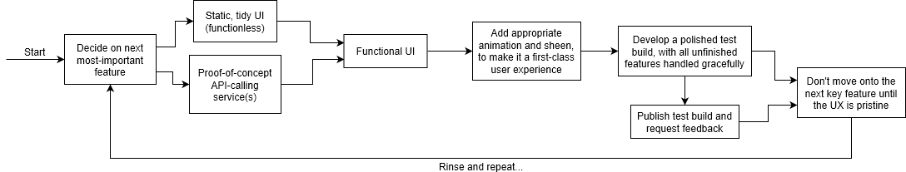

#  FetGo

## Development

### Workflow

I plan to develop this app in a very iterative way. I’ll start by picking what I believe to be the most fundamental feature that would make the app useful, for instance, instant messaging, and develop that feature until it is a first-class experience: including, but not limited to, responsive layout, slick animations and page transitions, reactive loading, native notifications, and so on… Once that feature is sufficiently polished, I’ll distribute it to early adopters for alpha testing – as the app will then begin to have a usefulness over the full website – and I can obtain feedback in order to tweak and finalise the implementation. Only once the user experience is top-tier will I move onto developing the next key feature; at least until I have an MVP release out anyway.



### Environment

#### Node.js

1. Go to https://www.nodejs.org/ and download the latest current (not LTS) build of _Node.js_.
2. Run though the installer, make sure the _npm_ package manager is checked on the list of features to install, check the box that asks about automatically installing necessary build tools, and finally click _“Install”_.
3. When the installer has finished, a terminal window will appear for the aforementioned build tools. Press any key twice to start them installing.
4. Press _[Enter]_ when prompted to close the window, once installation has finished.

#### npm

1. Open a PowerShell instance (assuming Node was added to the path during its install).
2. Change the PowerShell working directory to the root of the repo once you’ve cloned it to your machine.
3. Issue the following command to install all of the repository’s dependencies:
```
npm install
```

#### Yarn

1. Open an elevated (as an admin) PowerShell instance.
2. Issue the following command to install Yarn:
```
choco install yarn
```
3. Select _“[Y]es”_ when asked if you want to run the Chocolatey install script.

#### Expo

1. In PowerShell, issue the following command to install the Expo CLI:
```
npm install -g expo-cli
```
2. Change the PowerShell working directory to the root of the repo.
3. Type `expo start` to spin-up a local development server.
4. Allow private network access when prompted by the firewall dialogue.

#### Devices

1. Install the [Expo Android app](https://play.google.com/store/apps/details?id=host.exp.exponent) to your Android device.
2. Once installed, open the app and tap _“Scan QR Code”_.
3. Scan the QR code that was printed to the PowerShell window.
4. Give the app a chance to download across the local network and then FetGo will load within the Expo app.

#### Changes

If you have the Expo dev server running, saving changes to source files will result in the app dynamically updating and reloading on your phone.
